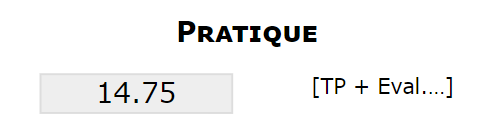
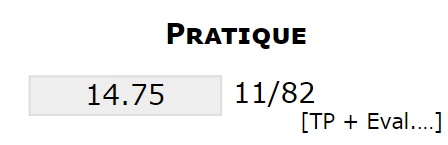
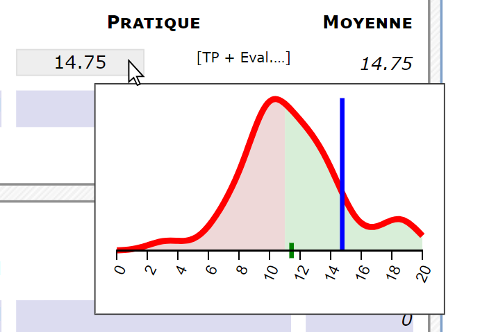
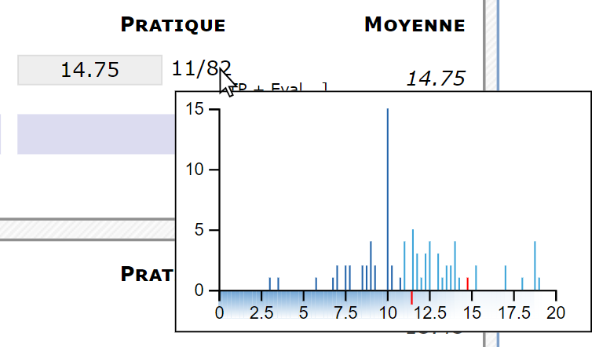
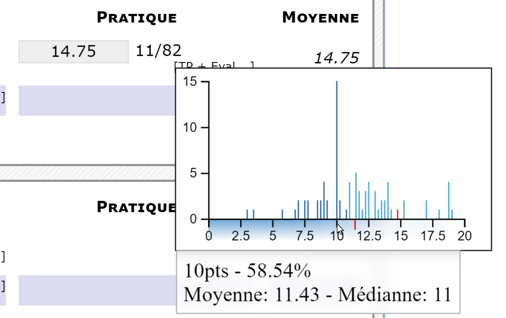
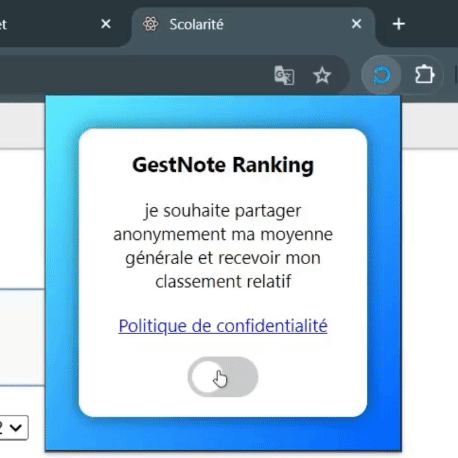

 -  -    

# GestNote Ranking

Chromium browser extension that enhances school grade consultation interface by adding advanced ranking and statistical analysis features.

The extension is available on the [Chrome Web Store](https://chromewebstore.google.com/detail/gestnote-ranking/nnghgmgfiemkbmbfdiacfceanmpdgbcd).

It leverages existing interface data to provide detailed analysis and comparisons with other students.

## ✨ Features

### 📊 Individual ranking per assessment
Automatic display of student rank for each grade with success percentage calculation.

Before | After
:---: | :---:
 | 

### 📈 Enhanced interactive histograms
Advanced statistical visualizations with detailed information on hover.

Before | After
:---: | :---:
 | 

**Displayed information:**
- Precise grade distribution with histogram
- Class average and median
- Percentage of students who achieved a grade equal or higher
- Your grade position in the distribution

<center>

</center>

### 🌐 Anonymous global ranking
Optional participation in general ranking with anonymous average sharing.

<center>

</center>

### 🔧 Automated build system
- Automatic minification and packaging of JavaScript files
- ZIP archive generation for distribution
- Chrome and Firefox support
- Dependency management and performance optimization

## 🏗️ Technical architecture

### Browser extension (`/extension`)
- **Content injection**: Dynamic modification of grade pages
- **User interface**: Configuration popup and preference management
- **Data processing**: Grade analysis and statistical calculations
- **Visualizations**: Interactive histograms with D3.js

### Backend server (`/server`)
- **RESTful API**: Global ranking management
- **Database**: Secure storage of anonymized data
- **Security**: HMAC authentication and abuse protection
- **Testing**: Automated test suite with Jest

### Development tools
- **Build system**: Node.js script for minification and packaging
- **Security analysis**: Log monitoring and anomaly detection
- **Maintenance**: Database cleaning and analysis tools

## 🚀 Installation and usage

### For users
1. Install the extension from the [Chrome Web Store](https://chromewebstore.google.com/detail/gestnote-ranking/nnghgmgfiemkbmbfdiacfceanmpdgbcd)
2. Navigate to your grade interface
3. Rankings and histograms are displayed automatically
4. Configure data sharing via the extension icon

### For developers
```bash
# Clone repository
git clone https://github.com/GabrielPlayeur/gestNoteRanking.git
cd gestNoteRanking

# Install server dependencies
cd server
npm install

# Build extension
node extension.build.js

# Start development server
npm start
```

## 📁 Project structure
```
gestNoteRanking/
├── extension/          # Extension source code
│   ├── content.js      # Main injection script
│   ├── histogram.js    # Chart management
│   ├── popup.js        # Configuration interface
│   └── manifest.json   # Extension metadata
├── server/             # Node.js backend
│   ├── app.js          # Express application
│   ├── routes/         # API routes
│   ├── models/         # Data models
│   ├── utils/          # Security utilities
│   └── tests/          # Automated tests
├── build/              # Compiled files
└── dist/               # Distribution archives
```

## 🔒 Security and privacy

- **Anonymization**: No personally identifiable data is stored
- **Encryption**: Secure communications with HMAC signatures
- **Monitoring**: Automatic detection of abuse attempts
- **Compliance**: Adherence to data protection standards

## 🤝 Contributing

Contributions are welcome! Feel free to:
- Report bugs via Issues
- Propose new features
- Submit Pull Requests
- Improve documentation

## 📄 License

This project is licensed under [MIT](LICENSE) - see the LICENSE file for details.

## Authors 
Gabriel Teigné